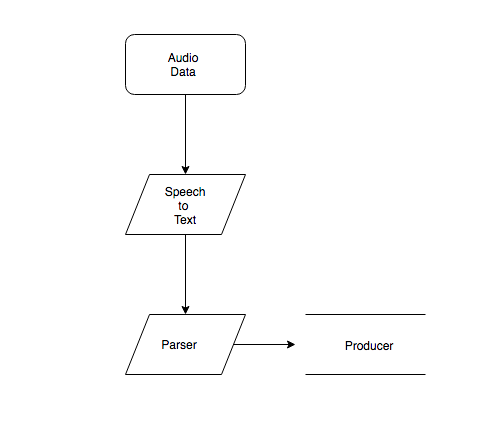

# Marvis
Marvis is a form of voice controlled presentation navigation system. The user story here is a pastor in church giving a sermon. When the pastor calls on a verse of the bible to be displayed to the audience, someone has to manually put the text into a search engine and then displays it on a projector screen. With this project the pastor should be able to call on a bible verse and have it displayed to his audience without human intervention.
## System Architecture :office:
</img>
## App Components
This repository contains one of three parts to the system. This part of the system takes the audio data coming from the user translates it to text, parses the text to get the user's intent and then produces it to another part of the system for futher actions. The system Architecture is a layered architecture with 2 tiers.
## Technologies Used
- Programming language
  - Python :heart:
- Speech Recognition
  - Google Speech to text
- Natural Language Processing
  - Dialogflow
- Message broker
  - Google pub/sub
# Author
- Tinuade Adeleke @tinumide

